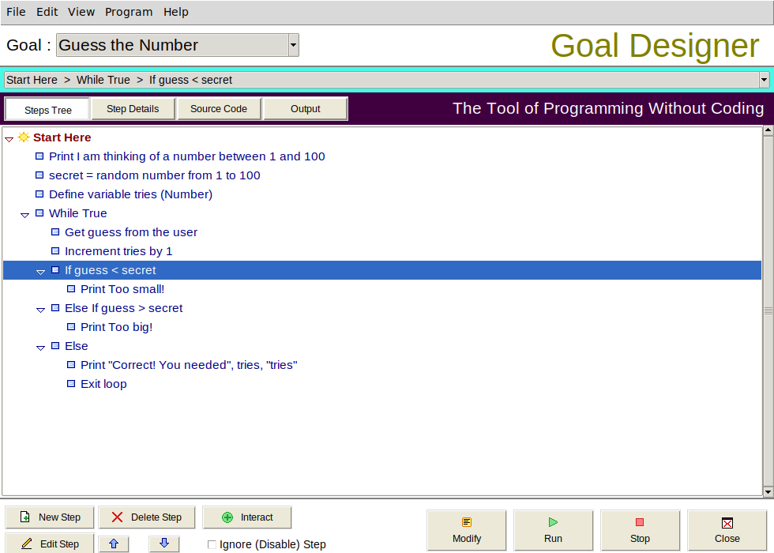
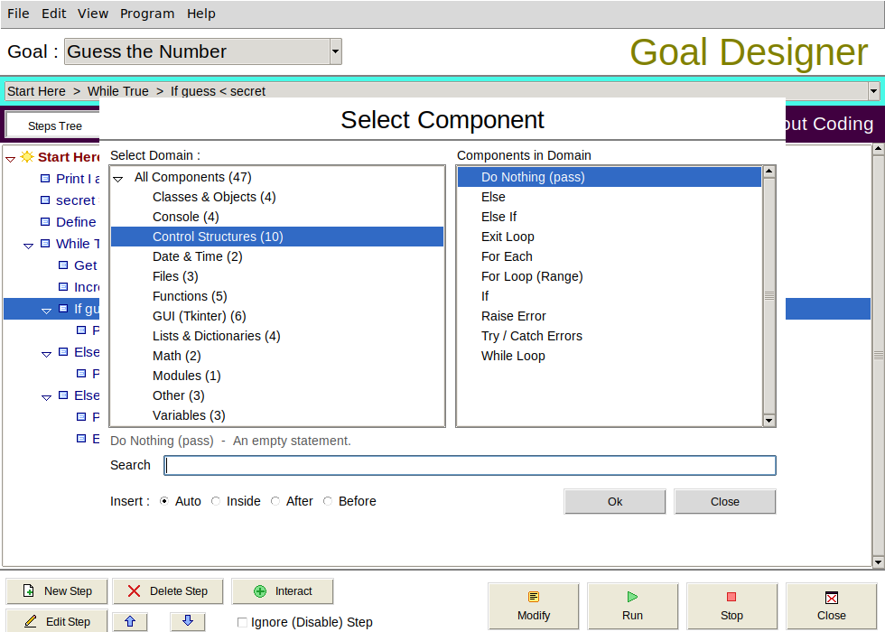
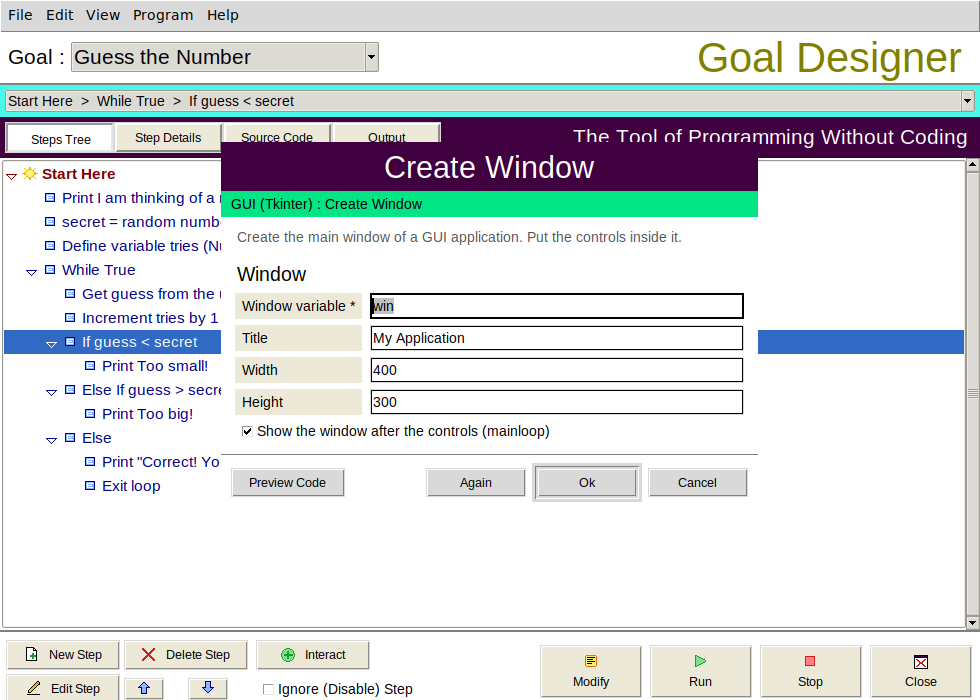

# PWCT-Python

A visual programming environment written in Python and inspired by
**PWCT – Programming Without Coding Technology** (Mahmoud Fayed, 2006‑2010).
You build a program as a tree of steps by filling small forms
(*interaction pages*); PWCT-Python generates the Python code, shows it and
runs it.



The windows follow the forms of the original PWCT: the **Goal Designer**
(`rpwi.scx`), the **Select Component** browser (`selser.scx`) and the
**Interaction Using Transporter** page (`runtrf.scx`), with the same
layout and colours.

| Select Component | Interaction page |
|---|---|
|  |  |

## بالعربية

**PWCT-Python** بيئة برمجة مرئية مكتوبة بلغة بايثون، مبنية على فكرة برنامج
PWCT (البرمجة بدون كتابة كود). بدل كتابة الكود:

1. تختار خطوة في **مصمم الأهداف** (Goal Designer)، وفي البداية توجد خطوة "Start Here" فقط.
2. تضغط **Interact** (أو Ctrl+Space) فتظهر نافذة **Select Component**: المجالات على اليسار والمكونات على اليمين (طباعة، إدخال، شرط، حلقة، دالة، صنف، نافذة رسومية...).
3. تملأ **صفحة التفاعل** (Interaction Page) وتضغط OK، فتُضاف خطوات جديدة للشجرة.
4. تُولَّد شيفرة بايثون تلقائياً ويمكنك تشغيلها بـ F5 ومشاهدة المخرجات وإدخال البيانات.
5. للتعديل: اختر الخطوة واضغط **Modify** (أو انقر عليها مرتين) فتُفتح صفحة التفاعل من جديد، وتبقى الخطوات التي أضفتها داخلها كما هي.
6. عند حدوث خطأ أثناء التشغيل يتم تحديد الخطوة المسؤولة عنه في الشجرة.

التشغيل:

```bash
python -m pwct                                    # فتح البيئة المرئية
python -m pwct pwct/samples/guess_number.pwct     # فتح مثال
python -m pwct run pwct/samples/hello_world.pwct  # تشغيل مشروع من سطر الأوامر
python -m pwct build project.pwct -o program.py   # حفظ الكود المولَّد
```

لا يحتاج أي مكتبات خارجية، فقط بايثون 3.8+ مع Tkinter
(على أوبونتو: `sudo apt install python3-tk`).

## How it maps to the original PWCT

The original source (Visual FoxPro IDE `RPWI` + Harbour libraries) keeps
every component in several DBF tables. PWCT-Python keeps the same ideas in
plain text:

| Original PWCT | PWCT-Python |
|---|---|
| Goal Designer (steps tree, `T38` table) | `pwct/engine/project.py` – `Project`, `Step` |
| Interaction pages (`IDF` / `ISF` files) | `[interaction]` section of a `.pwc` file, shown by `pwct/gui/interaction.py` |
| Transporter + template (`TRF`, field `F_MASK`) | `[template]` section of a `.pwc` file |
| Components tree (`MAHMOUD.PAF`) | folders of `pwct/components/`, `category:` field |
| `<RPWI:NEWSTEP>`, `PUTMARK`, `SETMARK`, `TEST`/`VALUE`/`POSITIVE`/`NEGATIVE`, `INFORMATION`, `IGNORELAST`, `TABPUSH`/`TABPOP` | same directives, `pwct/engine/template.py` (both `<RPWI:…>` and `<PWCT:…>` spellings) |
| Editing an interaction regenerates its steps, user sub-steps are kept | `Project.edit` |
| Code generation from the tree (Harbour / xBase) | `pwct/engine/generator.py` (Python, indentation from the tree) |

New in this version: `<PWCT:IF>/<PWCT:ELSE>/<PWCT:ENDIF>`, `<PWCT:FOREACH>`,
`<PWCT:IMPORT>` (imports collected at the top of the file) and placeholder
filters such as `<name|repr>` and `<name|ident>`.

## Features

* Goal Designer like PWCT: New Step, Delete Step, Edit Step, move up / down,
  Interact, Modify, "Ignore (Disable) Step", and the Steps Tree / Step
  Details / Source Code / Output views.
* Steps: add, modify (re-open the interaction), rename, delete,
  cut / copy / paste, move up / down / in / out, drag and drop,
  enable / disable (a disabled step is written as a comment), comments,
  unlimited undo / redo.
* 47 components in 12 categories: console, variables, lists & dictionaries,
  control structures (if / elif / else, for, while, try, break…), functions,
  classes & objects, modules, files, date & time, math, GUI (Tkinter) and
  free Python code.
* Code view synchronised with the tree (click a line to find its step).
* Run inside the environment with an input box; runtime errors select
  the step that caused them.
* Projects are JSON files (`.pwct`); the code can be exported as `.py`.
* Add your own components: put `.pwc` files in a folder and list it in the
  `PWCT_COMPONENTS` environment variable. See
  [docs/components.md](docs/components.md).

## Project layout

```
pwct/
  engine/        template language, components, steps tree, code generator (no GUI)
  gui/           Tkinter environment, interaction pages, program runner
  components/    the component library (.pwc files)
  samples/       example projects
tests/           unit tests (python -m unittest discover -s tests)
tools/           make_samples.py builds the samples with the engine API
```

## Using the engine from Python

```python
from pwct.engine import Library, Project, generate

lib = Library.default()
p = Project("Demo")
loop = p.apply(lib["control/for_range"], {"var": "i", "start": "1", "end": "3"})
p.apply(lib["console/print"], {"msg": "i", "kind": "Expression"}, parent=loop)
print(generate(p)[0])
```

## Tests

```bash
python -m unittest discover -s tests
xvfb-run python -m unittest tests.test_gui    # GUI tests on a server without a display
```

## Credits

The concepts (Goal Designer, interaction pages, components, RPWI template
directives) come from PWCT by Mahmoud Samir Fayed
(http://doublesvsoop.sourceforge.net). This is an independent re-creation
in Python; no code of the original is used.
